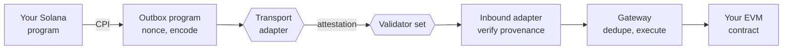
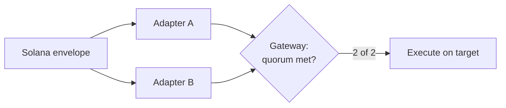

<!--
  Generalised design document, mirrored from the live doc:
  https://claude.ai/code/artifact/8d4c39c4-d1f7-42bb-8512-4913f89f9a86

  The live doc is the editable source; this file is the versioned snapshot
  committed alongside the code it describes. docs/01..05 are the Base-specific
  instantiation of this design.
-->

# Solana-to-EVM Contract Invocation

*A general design for invoking contract functions on an EVM chain from a Solana program.*

2026-09-18 · @Someone

## Where we are

Phase one is implemented and verified on both chains in-process and on a local validator. The one remaining phase-one exit criterion is a message landing end to end on **public** testnets, which needs funded keys and RPC endpoints. All four open design questions are answered and their consequences are in the code.

### Implementation status

| Component | Status | Verified by |
| --- | --- | --- |
| Envelope codec, Rust and Solidity | Done | 5 unit tests, frozen golden vector, cross-language parity on the 103-byte layout |
| Gateway | Done, phase-one scope | 28 behaviour tests on an in-process Cancun EVM |
| Callable base + config-invoke target | Done | Covered by the gateway tests, including the version-guard flow end to end |
| Adapters (Wormhole, LayerZero) | Written, compile | Not yet exercised against real transport contracts |
| Outbox program: prepare / dispatch / finalize | **Done, executes** | Real SBF build; 5 program-tests through BanksClient; 4 TypeScript tests through the Anchor client on `solana-test-validator` |
| Wormhole transport module | Skeleton | CPI shape exercised against a mock; account order and fee layout unverified against the deployed bridge |
| LayerZero transport module | Stub, by design | Needs the official Solana OApp SDK |
| Testnet end to end | Not started | Needs funded devnet and Base Sepolia keys |

### Phase progress

| Phase | Scope | Status |
| --- | --- | --- |
| 1 | Envelope, gateway, one adapter, one target | Code complete and executing on both sides locally; public-testnet run pending |
| 2 | Second adapter; quorum mode | Gateway side done and tested; Solana prepare-once-dispatch-twice state machine done and tested |
| 3 | ACCOUNT mode; fee accounting | Gateway side present and tested, gated off; fee accounting not started |
| 4 | Audit; mainnet with caps | Not started |
| 5 | Return path | Not started |

### What the tests actually prove

**Destination side.** Every row of the failure taxonomy has a case showing the gateway's response: duplicates and terminal conditions return without reverting, parkable ones mark `Failed` and retry, transient ones revert. Beyond that: replay across adapters, quorum with expiry enforced at quorum time, the 63/64 gas floor leaving an under-gassed message untouched, retry with a gas override, strict mode park-then-allow, ACCOUNT-mode deployment at the predicted address and reuse on the second message, a DIRECT call into another sender's account refused (T11), and the config-version pattern: a stale invoke parks, the config lands out of order, a permissionless retry succeeds.

**Source side.** The real SBF binary, not a native re-entry: `prepare` assigns nonce 1 and stores an envelope whose header decodes field by field to the spec; `dispatch` performs the CPI with the PDA-signed emitter and sets the transport bit; a second dispatch over the same transport is refused; dispatch over a transport not selected at prepare is refused; `finalize` before every expected transport has dispatched is refused; `finalize` closes the account and refunds rent to the original payer; the next `prepare` is nonce 2, so nonces are gapless. The same flow passes through the TypeScript client against a running validator, which is what an integrator will actually use.

### Found during implementation

- Three real Anchor errors that reading could not catch and `cargo check` did: a 31-byte placeholder program id, a missing `init-if-needed` cargo feature, and a mutable borrow held across a second borrow of the context in both dispatch instructions.
- Two `#[error_code]` enums both defaulted to offset 6000 and would have produced colliding error codes; merged.
- A DIRECT-mode call targeting another sender's smart account would have driven its `execute()` with the gateway as the trusted caller. Every deployed account is now a forbidden target, and the drain attempt is a test.
- Getting Anchor 0.30.1 to build on a 2026 host took four separate fixes, each now captured in the repo rather than in someone's memory: the SBF toolchain's cargo cannot read v4 lockfiles (lockfile committed as v3); the host resolver locks crates the SBF toolchain cannot build (`rust-version` declared, MSRV-aware resolution enabled, `blake3` pinned); Anchor's IDL step runs on `cargo +nightly` and needs a nightly from before April 2025 (`RUSTUP_TOOLCHAIN=nightly-2025-03-10`, `proc-macro2` pinned to 1.0.94); and `solana-program-test`'s dependency tree has to live in its own workspace so it stays out of the programs' lockfile.
- Foundry is unreachable from the build environment; the gateway suite runs on `@ethereumjs/vm` and is portable to Foundry when available.

### Next

1. One message end to end, devnet to Base Sepolia, over one adapter. Needs funded keys and RPC endpoints.
2. Verify and pin the transport constants: LayerZero's Base endpoint id, Wormhole's consistency-level encoding, core-bridge account ordering. The documentation sites are blocked from the build environment.
3. Wire the LayerZero transport module to the official SDK and add a `quote` instruction.
4. Choose the two independent DVN operators for the mainnet configuration path.
5. Key transport configuration by (transport, destination) before a second chain.

The reference implementation lives on the `claude/nice-noether-i07q6i` branch. `cd evm && npm test`, `cd solana && npm run build && npm run test:local` (with a validator running), and `cd solana/program-tests && SBF_OUT_DIR=../target/deploy cargo test` reproduce the checks above.

## The problem, and the constraint that shapes everything

No native path exists between Solana and any EVM chain, so every Solana-to-EVM call rides a third-party general message passing (GMP) protocol whose validator set becomes your trust root.

Solana has no notion of an EVM chain. EVM rollups bridge only to their own settlement layer — an OP Stack chain's native messenger reaches Ethereum L1 and nothing else. There is no exception to route around.

That single fact drives every decision below:

> **The transport is the risk. So the transport must be swappable, and authorization must not live inside it.**

The consequence is worth stating bluntly, because the temptation with any abstraction layer is to believe it buys more safety than it does. If the transport's validators collude or are compromised, they can forge a message from any Solana sender, and every verification step in this design passes cleanly. Most controls here are meaningful *conditional on the transport being honest*. Exactly one control addresses the transport itself; it appears under Transport selection.

### What a complete solution needs

| Requirement | Why it is not optional |
| --- | --- |
| Authenticated origin | The EVM contract must know *which* Solana account authorized the call, not merely that some message arrived |
| Replay protection | GMP protocols deliver at-least-once; a duplicate must be a no-op |
| Transport independence | Your application outlives your bridge choice, and bridges fail |
| Failure isolation | One reverting call must not wedge the channel behind it |
| Bounded staleness | Cross-chain latency is unbounded when a transport degrades; a call landing six hours late can be worse than one that never lands |
| Fee accounting | Execution on the destination must be paid for from the source |

### Scope

Solana as source, any EVM chain as destination. The destination appears only as a chain identifier and a set of deployed addresses, so nothing here is specific to one rollup. The return path is symmetric and left to a later phase — the one thing phase one must not do is hard-code the assumption that the source chain is always Solana.

## Architecture: three layers

Split the system so that the risky part (the transport) is the only part you can replace without touching anything else.



**1. Intent layer (Solana).** One outbox program is the only thing that mints outbound messages. Callers are user wallets or, more usefully, other Solana programs that invoke it via CPI with `invoke_signed`, passing one of their own PDAs as the authorizing identity.

This is the part that makes the whole design worth building rather than using an off-chain signer. A PDA has no private key. The identity that arrives on the EVM side is one that only the calling program's logic can produce — an attacker must compromise that program or its upgrade authority, not steal a key.

**2. Transport layer.** A GMP protocol, plus a thin adapter on each side. Each side trusts exactly one registered peer on the other. The adapter's only job is to prove the bytes came from that peer and forward them unmodified.

**3. Execution layer (EVM).** A single gateway contract verifies the message arrived through an authorized adapter, replay-protects it, and executes the call while exposing the originating Solana pubkey to the target.

### Why this shape

**It reuses a mental model EVM developers already have.** The target-side authorization check is:

```solidity
require(msg.sender == address(gateway));
require(gateway.xDomainMessageSender() == EXPECTED_SOLANA_AUTHORITY);
```

That is the same `xDomainMessageSender()` pattern OP Stack's `L2CrossDomainMessenger` uses. Nobody learns a new model, and the check is one line to audit.

**The transport becomes a runtime detail.** No application contract imports a bridge-specific type. You can switch transports, run two in parallel, or require agreement from two independent ones for high-value calls, without changing a single application contract.

**Authorization sits next to the assets.** The gateway deliberately does not decide whether Solana key X may call function Y. That belongs in the contract holding the funds — see the next section.

## The message envelope

One canonical byte layout, produced on Solana and parsed by the gateway, carrying no reference to any transport. Adapters wrap these bytes in their own payload and unwrap them again.

Pack it big-endian with a fixed header, not as an ABI-encoded struct on one side and Borsh on the other. A packed layout is written on Solana with plain byte appends and read on the EVM side with cheap word loads and shifts — and, more importantly, it is one table that both codecs implement, which is much easier to keep honest than two schema definitions that look equivalent.

| Offset | Size | Field | Notes |
| --- | --- | --- | --- |
| 0 | 1 | version | Gateway rejects anything it does not know |
| 1 | 1 | msgType | Reserved for future message kinds |
| 2 | 2 | srcChainId | **Your** internal chain id, not the transport's |
| 4 | 2 | dstChainId | Which chain executes this; each gateway checks it against its own |
| 6 | 32 | sender | Solana pubkey — wallet or program PDA |
| 38 | 8 | nonce | Per-sender counter |
| 46 | 20 | target | EVM contract to call |
| 66 | 16 | value | Native token to attach (uint128) |
| 82 | 8 | gasLimit | Gas for the inner call |
| 90 | 8 | expiry | Unix seconds; 0 = never |
| 98 | 1 | mode | Execution mode — see Design decisions |
| 99 | 4 | calldataLen | uint32 |
| 103 | n | calldata | ABI-encoded call, selector first |

### Message id

```
messageId = keccak256(entire envelope)
```

Hash the whole envelope, not just `(sender, nonce)`. Hashing only the identity triple would let a transport deliver a body differing from the one the sender authorized while still matching a dedupe key the gateway treats as canonical. Hashing everything makes any mutation a different message, which then fails the adapter's provenance check. Uniqueness still holds because the nonce is inside the hash.

### Three details that matter more than they look

**`srcChainId` and `dstChainId` are yours, not the transport's.** Every GMP protocol has its own chain namespace and they disagree — one calls Solana `1`, another calls it `30168`. Adapters translate at the boundary. If the envelope carried a transport-specific id, swapping transports would change the hash of otherwise identical messages and break every stored dedupe key and the dual-transport quorum along with it. Keep one small registry shared by both codecs (`1 = Solana, 2 = Ethereum, 3 = Base, …`), append-only.

**`dstChainId` is what makes a second destination safe.** Every gateway is deployed knowing its own id and rejects an envelope naming any other. Without the field, a message meant for one chain could be delivered — valid signatures and all — to a gateway on a second chain that trusts the same Solana program, and executed there. This is cheap insurance even with one destination today; it is mandatory the day there are two.

**Keep `sender` at 32 bytes.** Do not truncate a Solana pubkey to 20 bytes to make it resemble an address. Truncation creates collisions between distinct Solana accounts, and a collision here is an authorization bypass.

**Set `expiry` on anything economically meaningful.** Cross-chain latency is unbounded when a transport degrades. A price-sensitive call landing hours late can do more damage than one that never lands.

### Guarding against codec drift

The encoder and decoder are two hand-written codecs over one layout, in two languages. Drift is silent on the sending side and shows up as a misparse on the receiving side — the worst possible failure mode.

Freeze a golden vector on both sides: a fixed input whose exact output bytes are asserted in the source-chain test suite, and a destination-side test that parses those same bytes and checks every field. Any layout change is then a version bump, not a silent reinterpretation.

The gateway should accept a *set* of versions rather than exactly one. During a format upgrade, v1 messages are still in flight when the source starts emitting v2; a gateway that accepts only the latest strands them. Add the new version before the source emits it, retire the old one after its longest plausible in-flight window (bounded by `expiry`) has passed. Unknown versions are still rejected outright, never best-effort parsed.

## Design decisions

### D1. Where authorization lives

|  | (a) Gateway allowlist | (b) Target-side check |
| --- | --- | --- |
| Rule | Gateway holds `(sender, target, selector)` → bool | Each target checks the origin sender itself |
| New integration | Governance action on the gateway | Deploy your contract, done |
| Gateway owner compromised | Reaches every integrated contract | Still reaches every contract that trusted it |
| Where an auditor looks | One central mapping | The contract holding the funds |

**Make (b) mandatory and (a) optional hardening.**

A gateway whose owner can authorize arbitrary `(target, selector)` pairs is a honeypot: one key compromise reaches every integrator at once, and integrators have no way to defend themselves. With target-side checks, each contract states its trust assumption in its own source, and onboarding needs no privileged action from anyone.

Keep a per-target opt-in strict mode for high-value contracts, enforced by the gateway *on top of* the target's own check, never instead of it.

The failure this guards against: a target that checks only `msg.sender == gateway` and not the origin sender is callable by **every** Solana account in existence. It costs nothing to get wrong and gives no symptom — your own calls keep working, and so does everyone else's. Ship a base contract that implements the check so nobody writes it by hand.

### D2. Typed intents or raw calldata

**Raw calldata, with an opt-in per-target selector allowlist.**

Typed intents (an enum plus args, mapped on the destination to a specific function) look safer, but the risk they address — a compromised Solana authority calling something unintended — is already bounded by the target's own origin check. Meanwhile they impose a coordinated two-chain upgrade for every new action, which is a real and recurring cost. Targets wanting a tighter bound register their selector set.

### D3. Whose `msg.sender` the target sees

Two modes, selected per message by the envelope's `mode` byte.

**DIRECT.** The gateway calls the target itself; the target reads the origin sender from the gateway. Cheapest path. Right for contracts you own and have written to be cross-chain aware.

**ACCOUNT.** The call routes through a minimal smart account — one per sender, at a CREATE2 address derived from the Solana pubkey. The target sees an ordinary contract caller with a stable address and no special semantics.

ACCOUNT mode matters more than it first appears. It gives each Solana sender a durable destination-chain identity that can hold native tokens, ERC-20s, NFTs and approvals scoped to itself. Without it, interacting with any third-party contract not written for your system means either the gateway holds everyone's funds in one pot — cross-tenant contamination, and one bug drains all of it — or you cannot hold assets on the destination at all.

Use DIRECT for your own contracts, ACCOUNT for everything you did not write.

### D4. What happens when the inner call reverts

**Catch the revert, park the message, allow permissionless retry.**

If a delivery reverts wholesale, the transport either retries forever or treats the message as stuck — and on an ordered channel, one poisoned message blocks everything behind it.

Instead: record the failure, emit the revert data, and return successfully to the adapter. The message is consumed from the transport's view but not lost; anyone can retry it later, optionally with a higher gas limit. This is the difference between "a transient failure costs a retry" and "a reverting target wedges the channel."

The rule generalises into a taxonomy the gateway must apply consistently, because the wrong response to each class is a live failure mode:

| Class | Examples | Correct response | Wrong response and its cost |
| --- | --- | --- | --- |
| Permanent rejection | expired, unknown version, wrong source chain, malformed | Record as terminal, emit, **return success** | Revert → transport queues for redelivery → retry loop that never ends |
| Transient infrastructure | relayer under-supplied gas, gateway paused | **Revert** so the transport redelivers later | Consume → message silently lost |
| Execution failure | target reverted, insufficient sender balance | Park as `Failed`, **return success**, permissionless retry | Revert → same loop as row one; consume without parking → lost |
| Duplicate | same id, any adapter | Emit, **return success** | Revert → loop |

The distinguishing question is: *will retrying with no change on our side ever succeed?* If no, consume it. If yes because something external will change, revert. If yes because a human can act, park it.

### D5. Ordering and delivery guarantees

Assume **at-least-once, unordered**. It is the weakest guarantee across candidate transports and designing for it costs nothing.

- *Idempotency is unconditional.* Mark the message id consumed before executing. A duplicate is a no-op whichever adapter it arrives through.
- *Ordering is the application's job.* The per-sender nonce travels in the envelope and is exposed to the target, so a contract needing sequence keeps its own `lastNonce` and rejects out-of-order messages.

Do not enforce global ordering in the gateway. It converts every stuck message into a full outage — exactly what D4 exists to prevent.

### D6. Fees and gas

The envelope carries a `gasLimit` and a `value`. Three things have to be funded, from three different places, and conflating them is a common source of stranded messages.

**Transport fee** is paid on Solana at send time, in SOL, quoted by a `quote` instruction the outbox exposes. Clients call it, then attach the fee. Quotes go stale as destination gas moves, so the outbox should accept a fee above the quote and refund nothing — an under-quoted send fails at the transport, which is the cheap place to fail.

**`value` — native token attached to the inner call — comes from a different place per mode.** In ACCOUNT mode it comes from the sender's own smart account, which is the point of the account existing: it holds the sender's assets. In DIRECT mode there is no per-sender account, so the gateway keeps a per-sender prefunded ledger that anyone can top up. Do not keep one pooled gateway balance; the ledger is what stops one sender's message spending another's deposit. *Phase one ships with `value` reserved-zero and none of this machinery — see Decisions taken.*

**Execution gas** is whoever submits the delivery transaction. With an auto-executing transport, the executor fronts it and was paid at send time. With a self-relayed transport, the relayer fronts it, which raises the question of who reimburses. Three workable models:

| Model | Who pays destination gas | When it fits |
| --- | --- | --- |
| Self-operated relayer | You, from an ops budget | You control all senders; simplest |
| Protocol executor | Sender, at send time, via the transport | Default with an auto-executing transport |
| On-chain reimbursement | Sender's gateway ledger pays `tx.gasprice × gasUsed` to the submitter | Permissionless relaying by third parties |

Start with the first two. On-chain reimbursement is the one that makes relaying permissionless, but it needs a price cap per message or a relayer can drain a sender's ledger by submitting at an inflated gas price.

**The gas floor.** Before the inner call, require `gasleft() >= gasLimit × 64/63 + reserve`. Without it, a relayer can submit a delivery with just barely too little gas; the inner call receives 63/64 of not-enough, reverts out of gas, and the message is consumed as failed — cheap griefing that this one check closes. Two corrections to the naive form:

- In ACCOUNT mode, a sender's first message also deploys its account. The deployment cost must be counted in the floor, or first-use messages have less than `gasLimit` left by the time the target runs.
- The check must sit *after* everything the gateway does before the call, not at function entry, or the bookkeeping between the check and the call erodes it.

### D7. The return path

Out of scope for phase one, symmetric when wanted: the gateway emits an envelope, the same adapter set carries it back, an inbox program on Solana verifies and dispatches via CPI. Design phase one so this is additive — in particular, never assume anywhere that `srcChainId` is always Solana.

## Transport selection

Pick a default for developer experience and operational burden, then build a second adapter in the same phase for independence. The comparison below is against this specific use case — arbitrary contract invocation from Solana — not a general ranking.

|  | LayerZero v2 | Wormhole | Hyperlane | Chainlink CCIP | Axelar |
| --- | --- | --- | --- | --- | --- |
| Auto-execution on destination | Yes (Executor) | Own relayer / exec service | Own relayer | Yes | Yes (gas service) |
| Trust root | Your DVN set | Guardian set | Your own ISM | DON + risk network | Validator set |
| Per-app security config | **Yes** | No | **Yes** | Limited | Limited |
| Self-serve deployment | Yes | Yes | Yes | Permissioned | Yes |
| Ops burden | Low | Medium | High | Low | Low |
| Solana maturity | Good | **Highest** | Moderate | Newer | Newer |
| Message artifact | In-protocol | **Portable, self-relayable** | In-protocol | In-protocol | In-protocol |

### Recommendation

**Default to LayerZero v2. Build a Wormhole adapter in the same phase.**

LayerZero first for two reasons. Its Executor calls your destination contract automatically, removing an entire operational component from the critical path. And its verifier set is configured per application rather than inherited from the protocol — requiring two independent verifiers is a config change, not a redeployment.

Wormhole in the *same* phase, not later. The adapter abstraction is unproven until a second implementation exists, and building it is what surfaces the places where transport-specific assumptions leaked into the gateway. That is far cheaper to discover before launch than after. It also buys two concrete things: a validator set disjoint from any DVN set you configure, and a self-relayable fallback, since its attestations are portable artifacts anyone can submit by hand if every relayer disappears.

Hyperlane is the right answer later if you grow large enough that running your own validator set is cheaper and safer than renting one. CCIP is worth revisiting if institutional counterparties need a named, accountable operator.

### Per-app verifier choice, and what a DVN is

The recommendation above rests on one property of LayerZero: the application chooses who verifies its messages. This subsection explains that property from the ground up, because the mainnet configuration decision depends on understanding it.

**Every bridge has a group of witnesses.** Some set of parties watches the source chain and attests "this message was genuinely sent." That group is the trust root — if they collude, they can forge a message, and every check downstream passes. The design's threat model (T1) says this is the one failure nothing else mitigates.

**On most bridges the group is fixed by the protocol.** Wormhole has 19 guardians; every application using Wormhole trusts the same 19. You cannot choose them, add to them, or require extra signers for your own high-value messages. You inherit the protocol's security whole.

**On LayerZero v2 the application chooses its own group.** The witnesses are called DVNs — Decentralized Verifier Networks — and when you deploy your adapter you configure which of them must sign before a message to your contract counts as verified.

**What a DVN does, mechanically:**

1. Your message is written to LayerZero's endpoint on Solana, producing a hash.
2. The DVN watches Solana, sees the message, waits the number of block confirmations you configured, and independently confirms that a message with that hash was committed.
3. It writes that confirmation to the destination chain.
4. Once every DVN your app requires has written a confirmation, the message is verified and the Executor delivers it to your adapter.

A DVN is a witness, nothing more. It moves no funds and executes nothing; it attests that a message exists on the source chain. Independent operators run them — infrastructure companies, security firms, sometimes the protocol team itself — each with separate infrastructure and separate keys. The name: *Verifier* because that is its only job; *Network* because each operator runs it as a distributed service; *Decentralized* because there is no fixed list and no privileged member, and each application picks its own.

**What the choice looks like in practice.** For the configuration-target path, a mainnet setting might be:

| Setting | Example | Effect |
| --- | --- | --- |
| Required DVNs | Operator A **and** Operator B | Both must sign; two unrelated companies |
| Optional DVNs | any 1 of Operators C, D, E | One more independent confirmation |
| Confirmations | N finalized Solana blocks | The reorg guard (T2), enforced by the witnesses |

A message to your contract executes only if that exact combination signed it. Another application on the same LayerZero deployment may require one DVN, or five. Your security is yours.

**Why it matters here.** It delivers the T1 mitigation — independent parties must agree — *inside one transport*, and it is a configuration change rather than a redeployment. Start on testnet with a single default DVN; add a second before mainnet without touching the gateway or any target. It also stacks with the dual-transport quorum below: LayerZero with two DVNs plus Wormhole's guardians means three disjoint groups must all agree for a high-value call.

**The trade-off.** You are now responsible for choosing well. Two DVNs run by the same company, or two that depend on the same RPC provider, give less independence than they appear to. Choosing operators with genuinely separate infrastructure is a judgment call to make with current documentation in hand, since the roster of operators changes. The decision to take before mainnet is not *whether* to require two DVNs on the config path — yes — but *which two*.

### Dual-transport quorum — the one control that addresses transport compromise

For high-value targets, require the same envelope through two transports before executing.



Because the message id is the hash of a transport-neutral envelope, both adapters naturally produce the same id for the same message. The gateway counts distinct adapters that delivered it and executes on the Nth.

**This only works if both transports carry byte-identical envelopes, which the naive source-side design does not produce.** An outbox that increments the sender's nonce on every send, with one instruction per transport, gives the same logical call two different nonces on two transports — two different hashes, two different message ids, and a quorum that is never met. The fix is on the Solana side: split *prepare* from *dispatch*. One instruction builds the envelope, assigns the nonce and stores the bytes in a PDA; a per-transport instruction then reads that PDA and forwards it unchanged. Two dispatches of one prepared envelope produce one message id on the destination. Close the PDA once every intended transport has dispatched, and let the sender choose which transports at prepare time so a partially dispatched message is visible on-chain.

This is the only mitigation that actually addresses transport compromise; every other control in this design assumes the transport is honest. Forging a call now requires compromising two disjoint validator sets simultaneously. Choose verifiers that are not operationally related to the other set, or you have bought less independence than you think.

The costs are real: you pay both transports, you wait for the slower one, and liveness now depends on both rather than either. So make it a per-target setting, not a global mode. Turn it on for the treasury; leave it off for telemetry.

### Switching transports later

1. Write the new adapter on both sides.
2. Register it and its peers in both directions.
3. Move traffic by changing the default transport on the source side.
4. Keep the old adapter enabled until every in-flight message has landed or expired, then disable it.

No application contract changes, no envelope change, and no dedupe migration — the message id does not depend on the transport, so a message in flight on the old one and a retry on the new one still deduplicate against each other.

### How agnostic this actually is

Agnostic where lock-in would hurt; not agnostic on the Solana program, by design. Here is what each half means and why the line sits where it does.

**Lock-in hurts in exactly one place: the day you need to leave a bridge and cannot.** Bridges get exploited, deprecated or expensive. The question is what you would have to redo on that day. Three things would be catastrophic to redo, and none of them knows a bridge exists:

| What | Why redoing it would hurt | How the design avoids it |
| --- | --- | --- |
| Every application contract | Redeploy them all, migrate their state, re-coordinate every integrator | They import only the gateway interface; none can tell which bridge delivered its call |
| The message format | Every stored message id would compute differently on the new bridge; old and new messages could not be compared | The id hashes bytes that name no bridge, so a message in flight on the old transport and its retry on the new one still deduplicate |
| The gateway | It holds the replay map and quorum state; redeploying means migrating or losing them | It never touches a transport type; adding a bridge is one admin call |

On the destination side, leaving a bridge therefore costs one adapter contract of roughly a hundred lines and one `setAdapter` call. Nothing else moves.

**On Solana, adding a bridge is a program upgrade, and that is the right trade.** Each dispatch instruction declares up front exactly which accounts it expects and what must be true of them — this one a PDA with these seeds, that one signed, this address equal to the configured bridge program. Anchor enforces all of it before any code runs, and anyone auditing can read the account struct and know what is checked.

A generic `dispatch(transport_id, …)` taking an arbitrary account list would have to perform those same checks by hand, in code, per transport. Same checks, but imperative, easy to get subtly wrong, and invisible to a reader of the struct. "Forgot to verify that account was the real bridge program" is precisely the shape of bug that drains cross-chain systems.

So the choice is: pay a program upgrade per new bridge, or weaken account validation on every dispatch forever. An upgrade is a one-time, well-understood operation behind the multisig. Weakened validation is permanent. The upgrade is cheaper.

**The asymmetry is what makes it acceptable.** Ask who else must change when a bridge is added. On the destination: nobody — no integrator redeploys, no state migrates. On Solana: the operator, once, with an upgrade they control. The cost lands entirely on the party who chose to add the bridge and touches no one else's contracts or funds. That is the property an extension point should have.

**Concretely, adding a third transport:**

| Side | Steps | Who is affected |
| --- | --- | --- |
| Destination | Write the adapter (three checks, forward bytes); `setAdapter`; optionally raise `requiredConfirmations` on valuable targets | Nobody else. In-flight messages on existing transports still land |
| Solana | Write the transport module and its dispatch instruction with its own account context; add a mask bit; upgrade behind the multisig; `set_transport` to register the peer | Callers who want the new transport pass its bit at `prepare`. Everyone else changes nothing |

**One honest caveat.** "Agnostic" is a property of this code, not a guarantee about every conceivable bridge. Quorum works only if every adapter can hand the gateway byte-identical envelopes. Every protocol in the comparison table delivers opaque payloads, so this holds. A bridge that re-encoded payloads in transit could still be used alone, but could not serve as a second vote.

## Threat model

Ordered by blast radius, not likelihood. The first item dominates everything below it.

| # | Threat | Impact | Mitigation |
| --- | --- | --- | --- |
| T1 | Transport validator set compromise | **Total** | Dual-transport quorum; value rate limits |
| T2 | Source-chain reorg | Total | Publish and require attestation at finalized commitment |
| T3 | Solana authority key or PDA compromise | Scoped to that sender's rights | PDAs over wallets; one authority per privilege level; expiry |
| T4 | Target checks gateway but not origin sender | Contract open to all | Shared base contract with the two-part check |
| T5 | Replay | Duplicate execution | Message id consumed before execution |
| T6 | Gas griefing | Message burned as failed | 63/64 gas floor; permissionless retry |
| T7 | Stuck or poisoned message | Channel outage | Park failures, unordered delivery |
| T8 | Gateway owner key compromise | Equivalent to forgery | Multisig + timelock; alert on adapter and peer changes |
| T9 | Cross-sender fund contamination | Shared loss | Per-sender accounts (ACCOUNT mode) |
| T10 | Codec drift | Silent misparse | Golden vectors both sides; reject unknown versions |
| T11 | Privilege confusion via DIRECT mode | Gateway's own authority abused | Gateway holds no approvals or roles; system contracts blocked as targets |
| T12 | Relayer gas-price inflation | Sender ledger drained | Per-message reimbursement cap |
| T13 | Cross-destination replay | Message for chain A executes on chain B | dstChainId in the envelope; every gateway checks its own |

### The three worth expanding

**T1 — transport compromise is total, and most controls do not touch it.** A colluding validator set can forge a message from any sender; the adapter verifies the signatures, they are valid, the gateway executes. This is not a bug in the design, it is the assumption you accept by using a bridge. The quorum pattern is the only structural answer. As a secondary bound, cap value per period so a successful forgery is survivable rather than fatal — a rate limit that holds under total transport compromise is worth more than several controls that do not.

Be precise about where a cap can live. The gateway sees the envelope's native `value` and the message count, so it can cap those per sender and per target. It cannot see the token amount inside `calldata` — an ERC-20 transfer is opaque bytes to it. Token-flow caps therefore live in the target, which is one more reason authorization does. A gateway-level cap that looks comprehensive but only bounds native value is the kind of control that passes review and fails in the incident.

**T11 — a DIRECT-mode message runs with the gateway as `msg.sender`.** Anything the gateway is privileged to do, a sender can do through it. The defence is to make sure that set is empty: the gateway never holds ERC-20 approvals, never holds a role on another contract, and never owns anything but its own ledger. Block the gateway, its adapters and its account implementation as DIRECT targets, with an explicit allowlist for the few self-calls that are intended, such as a sender withdrawing its own ledger balance.

**T2 — the reorg guard is the setting most likely to be wrong, because the unsafe value is also the fast one.** A message attested at a confirmed rather than finalized commitment can be published on a slot that is later rolled back: the source state justifying the call never happened, but the attestation is genuine and the call executes. Everything works perfectly in testing right up until the one reorg that matters. Set finality on the publishing side *and* enforce it on receipt — two independent places, so a mistake in one is caught by the other. Put the pair on the deploy checklist explicitly.

**T3 — your real root of trust is a key on Solana, not anything on the destination chain.** Prefer program PDAs to wallet keys: a PDA has no private key to steal. But note that an upgradeable program's upgrade authority *is* the authority over every destination contract that trusts its PDAs. Put it behind a multisig or make the program immutable.

### Pre-deployment checklist

- [ ] Gateway owner is a multisig behind a timelock
- [ ] Source program upgrade authority is a multisig, or the program is immutable
- [ ] Finality level set on the publisher **and** enforced on the adapter, and confirmed to match
- [ ] Every transport constant (endpoints, chain ids, program ids) verified against live docs, not memory
- [ ] Every target inherits the base contract and checks the origin sender
- [ ] Two-transport quorum on every target moving meaningful value
- [ ] Rate limits sized to survive T1
- [ ] Alerting on adapter registration, peer changes, failures, pauses
- [ ] Pause runbook rehearsed on both chains — they pause independently, and pausing the source does not stop messages already in flight
- [ ] Golden-vector tests green on both sides
- [ ] External audit covering gateway, account factory, and every adapter
- [ ] Gateway, adapters and account implementation blocked as DIRECT targets; the gateway holds no approvals or roles anywhere
- [ ] Every row of the failure taxonomy has a test proving the gateway's response
- [ ] Quorum verified with one prepared envelope dispatched over both transports — not two separate sends
- [ ] Single-key admin replaced by a multisig behind a timelock, plus a separate pause-only key, **before any mainnet funds**

## Reference interfaces

The surface is small. Five components, of which application teams touch one.

| Component | Chain | Who writes it |
| --- | --- | --- |
| Outbox program | Solana | Platform team, once |
| Transport module | Solana | Platform team, per transport |
| Transport adapter | EVM | Platform team, per transport |
| Gateway | EVM | Platform team, once |
| Callable base contract | EVM | Platform team once; **inherited by every application** |

### Gateway

```solidity
interface IGateway {
    // Called by a registered adapter that has verified provenance.
    // MUST NOT revert on a duplicate: some transports queue a reverting
    // receive for redelivery, turning one duplicate into a retry loop.
    function deliver(bytes calldata envelope) external;

    // Re-run a message whose inner call reverted. Permissionless.
    function retry(bytes calldata envelope, uint64 gasLimitOverride) external;

    // The Solana pubkey that authorized the call currently executing.
    // Zero outside a delivery. This is the check targets must make.
    function xDomainMessageSender() external view returns (bytes32);
    function xDomainMessageNonce() external view returns (uint64);

    // Deterministic address for a sender under ACCOUNT mode; returns the
    // address whether or not deployed, so it can be funded ahead of use.
    function accountFor(bytes32 sender) external view returns (address);
}
```

Use transient storage (EIP-1153) for the two `xDomain` values and clear them after every execution.

### Transport adapter

An adapter has exactly one job, and the security of the system rests on it doing only that job:

- Verify the message against its transport's proof system
- Check the source chain is Solana in *that transport's* id namespace
- Check the emitter equals the registered peer, and nothing else
- Forward the envelope bytes unmodified

An adapter must never interpret the envelope. Parsing, replay protection, expiry, quorum and authorization all live in the gateway, so adding a transport cannot weaken any of them.

### What integration costs an application team

One immutable and one modifier:

```solidity
contract Vault is SolanaCallable {
    bytes32 public immutable CONTROLLER; // a Solana PDA

    function withdraw(address token, address to, uint256 amount)
        external
        onlySolanaSender(CONTROLLER)
    { ... }
}
```

Where the modifier is:

```solidity
modifier onlySolanaSender(bytes32 expected) {
    if (msg.sender != address(gateway)) revert NotGateway();
    if (gateway.xDomainMessageSender() != expected) revert BadOrigin();
    _;
}
```

Both halves are load-bearing. Shipping this as a base contract rather than documentation is what stops the second half being forgotten — see T4.

The origin sender is meaningful **only** when `msg.sender` is the gateway, and the modifier enforces exactly that pairing. A contract deeper in the call chain — called by a target, not by the gateway — must not consult `xDomainMessageSender()`: it would see the original Solana sender and mistake a nested call for a direct one. This is the same confused-deputy shape OP Stack's messenger has, and the same rule applies: read the origin sender at the boundary, then pass it down as an ordinary argument if callees need it.

On the Solana side, a program calls the outbox with its own PDA as the authorizing identity:

```rust
outbox::cpi::send(
    CpiContext::new_with_signer(program, accounts, &[&[b"controller", &[bump]]]),
    SendParams {
        target: VAULT_ADDR,
        value: 0,
        gas_limit: 200_000,
        expiry: now + 3600,
        mode: MODE_DIRECT,
        calldata: abi_encode_withdraw(token, to, amount),
    },
)?;
```

The identity arriving on the destination is a PDA no human holds.

### A note on Anchor and transport dispatch

Two practical constraints worth designing around rather than discovering.

First, Anchor account contexts are static, and different transports need different accounts. A single instruction dispatching on a `transport_id` argument would have to accept the union of every transport's accounts as optional and validate them by hand. Use a separate instruction per transport, each with its own context.

Second, and the reason the split goes further than one-instruction-per-transport: quorum needs the *same bytes* on both transports. So the outbox has three kinds of instruction, not two:

```rust
// 1. Build once. Assigns the nonce, stores the envelope in a PDA keyed by
//    (sender, nonce), records which transports are expected to carry it.
prepare(params: SendParams, transports: u8 /* bitmask */)

// 2. Dispatch per transport. Reads the PDA, forwards the bytes unmodified,
//    marks that transport as done. Each has its own account context.
dispatch_via_wormhole(nonce: u64)
dispatch_via_layerzero(nonce: u64)

// 3. Close the PDA once every expected transport has dispatched;
//    rent returns to the payer.
finalize(nonce: u64)
```

A single-transport send is `prepare` with one bit set followed by one dispatch, which a client can pack into one transaction. The prepared-but-undispatched state is visible on-chain, so a message that made it onto one transport and not the other is diagnosable rather than mysterious.

## Adoption path

### Deployment order

The two sides reference each other, so there is a bootstrapping order:

1. **Gateway** on the destination chain. Record the address.
2. **Outbox program** on Solana. Derive the emitter PDA — this is the identity the destination will pin.
3. **Adapters** on the destination, each with the PDA from step 2 as its peer. Register them with the gateway.
4. **Transports** on Solana, each with the adapter address from step 3 as its peer.
5. **Verify on testnet**, end to end, before anything else.
6. **Targets** with the expected Solana sender baked in as an immutable.
7. **Harden**: quorum on valuable targets, then hand ownership to the timelock.

Steps 3 and 4 are the mutual pinning, and they are the part unit tests cannot check — every constant there is a cross-chain identity. Get them wrong and messages are silently rejected, which is the good failure. Pin a peer you do not control and they are silently accepted.

Do not skip step 5 on the strength of unit tests.

### Latency expectations

Set `expiry` values against real numbers, not hopes. End to end is the sum of: Solana finality (roughly 13 seconds at 32 slots), the transport's observation and signing window (seconds to a couple of minutes depending on required confirmations), the relayer or executor's submission delay, and destination block inclusion. Under normal conditions expect **30 seconds to a few minutes**. Under a degraded transport the tail is unbounded, which is the case `expiry` exists for. An expiry under a minute will fail routinely; one over a day gives a stolen key a long runway. Somewhere between five minutes and a few hours fits most calls, chosen per call rather than globally.

### Phasing

| Phase | Scope | Exit criteria |
| --- | --- | --- |
| 1 | Envelope, gateway, one adapter, one target | Message lands end to end on testnet; golden vectors green |
| 2 | Second adapter; quorum mode | Same envelope delivered by both transports deduplicates to one execution |
| 3 | ACCOUNT mode; fee accounting | A Solana sender holds and spends assets on the destination |
| 4 | Audit; mainnet with caps | Rate limits verified to hold under a simulated forged message |
| 5 | Return path | Execution receipts reach Solana first; general calls after |

The temptation is to fold phase 2 into "later." Resist it — building the second adapter is what proves the abstraction holds, and it is far cheaper before launch than after.

### Testing strategy

Golden vectors catch codec drift and nothing else. The gateway needs its own suite, and the cross-chain parts need a run on real testnets.

| Layer | What to test | How |
| --- | --- | --- |
| Codec | Byte layout parity | Frozen vector asserted on both sides |
| Gateway | Replay, quorum, expiry, the gas floor, retry, mode routing, failure taxonomy | Unit tests with a mock adapter; every row of the taxonomy table gets a case |
| Gateway | "No message is ever both executed and retryable"; "ledger never goes negative"; "account address is stable across deploys" | Invariant / fuzz tests |
| Adapters | Provenance checks against real transport contracts | Fork tests against the deployed transport on the destination |
| Outbox | Nonce is gapless under CPI failure; prepare/dispatch state machine | Anchor tests with a mock transport program |
| System | The mutual pinning actually works | One message end to end on public testnets, before any mainnet step |

The last row is the one teams skip and the one nothing else covers.

### Operations

**Monitoring.** Alert on: messages dispatched on Solana with no matching execution after a threshold (relayer down or stuck); failed executions; messages delivered by one adapter and waiting on a second; and — page someone for these — adapter registrations and peer changes, which unplanned mean compromise. Track dispatch-to-execution latency as a distribution, not an average; the tail tells you a transport is degrading before it stops.

**Incident response.** On suspected transport compromise, pause the gateway *first* — it stops execution of everything already in flight, which pausing the source does not. Then pause the source program, then disable the suspect adapter. Paused gateway plus disabled adapter is the complete stop; either alone is not.

For a single misbehaving target, strict mode with an empty allowlist blocks that one contract without stopping the system.

**Relayers**, where the transport does not auto-execute, are stateless and permissionless: watch for dispatch, fetch the attestation, submit it. Losing relayer state loses nothing — re-derive from on-chain sequence numbers. Running two is safe; the duplicate settles quietly. A compromised relayer can delay or drop, never forge, so liveness needs monitoring and integrity does not.

### Upgrades

Make the gateway non-upgradeable. An upgradeable gateway is a key that can rewrite the rules for every integrated contract at once — a larger risk than the migration cost it saves.

To migrate, run both gateways in parallel: deploy the new one, register it as an additional transport on the source, move traffic, then leave the old one live until every in-flight message has landed or expired. Envelope expiry gives that drain a bounded end. Targets holding funds should accept messages from both gateways during the overlap, or they will need a second migration of their own.

The smart-account implementation is the exception that needs a deliberate choice. Accounts hold user assets, and clones point at one implementation. If that implementation is immutable, a bug in it strands every account's funds behind a migration each sender must perform. If it is upgradeable behind a beacon, the timelock can fix a bug in place — and can also change what every account does, which is a privileged key over all held assets. Neither is free. The recommendation is a beacon behind the same timelock as the gateway, with the upgrade delay long enough that senders can withdraw first if they disagree, and the decision written down so nobody later assumes the accounts were immutable.

### Decisions taken

The four questions this design left open have been answered. Each answer, and what it changed:

| Question | Answer | Consequence |
| --- | --- | --- |
| Which chain? | **Base now, others later** | The envelope gained a `dstChainId` field and every gateway checks its own id (T13). Transport configuration on Solana is keyed by transport today; key it by (transport, destination) before the second gateway ships. |
| Do calls need ordering? | **Not sure yet** | Default stays unordered. The per-sender nonce is already in the envelope and exposed to targets, so a contract that turns out to need sequencing can enforce it without any change to the gateway or the format. Revisit once the first two or three call types are known. |
| How much value per call? | **Varies a lot** | Confirms the two-transport quorum is a per-target setting, not global. Each contract declares its own threshold; a treasury can require both transports while telemetry uses one. |
| Who holds the keys? | **One person, for now** | Fine for testnet. Before real funds: a 2-of-3 or 3-of-5 multisig behind a timelock for admin, and a separate fast-path pause key that can only halt, never change anything. Added to the checklist. |
| What do the calls do? | Set a config on the destination, then invoke a function | Two call types with different privilege levels and a dependency between them. Use two authorities and a config-version guard rather than message ordering; see below. |
| Native token on calls in phase one? | No | The value field stays in the envelope, reserved, and must be zero. The gateway ledger, deposit and withdraw paths are deferred to the ACCOUNT-mode phase. Less surface to audit, and T11's self-call exemption goes away. |

### Applying the answers: config-then-invoke

The two call types are not symmetric, and the design should not treat them as one stream.

**Two authorities, not one.** Setting configuration is a privileged, rare action. Invoking is routine. Give each its own Solana PDA so that a compromise of the invoker cannot rewrite the configuration, and the target checks a different expected sender on each function. This is T3's "one authority per privilege level" made concrete.

**Do not solve the dependency with ordering.** An invoke that lands before the config change it depends on will run against stale configuration. The tempting fix is a `lastNonce` check on the target, but it reintroduces head-of-line blocking: one stuck config message then wedges every invoke behind it. Two better options, chosen by how the calls relate in time:

| Relationship | Pattern | Why it works |
| --- | --- | --- |
| Config and invoke always travel together | **One message.** The target exposes an atomic `configureAndInvoke(config, args)`, or a `multicall(bytes[])` the envelope's calldata targets | No cross-message dependency exists, so there is nothing to order |
| Config changes rarely; invokes are frequent | **Version guard.** Each config write bumps a `configVersion`; each invoke carries the version it expects and the target reverts on mismatch | The revert parks the invoke as `Failed`; once the config lands, anyone retries it. Nothing is wedged, nothing is lost |

```solidity
function setConfig(Config calldata c) external onlySolanaSender(CONFIGURER) {
    config = c;
    configVersion += 1;
}

function invoke(uint64 expectedVersion, bytes calldata args) external onlySolanaSender(INVOKER) {
    if (configVersion != expectedVersion) revert StaleConfig(configVersion, expectedVersion);
    _run(args);
}
```

The version guard is the recommended default. It uses the failure-parking machinery the gateway already has, keeps the gateway unordered, and makes "ran with the wrong config" impossible rather than merely unlikely.

**Phase one drops native value.** With no call needing to carry ETH, `value` is reserved-zero and the gateway enforces it. The per-sender ledger, `deposit`, `withdraw`, and the DIRECT-mode self-call it needed all move to the phase that introduces ACCOUNT mode. This removes an entire failure class (`InsufficientBalance`) and the one case where the gateway called itself.
